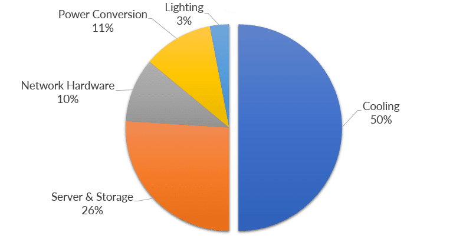
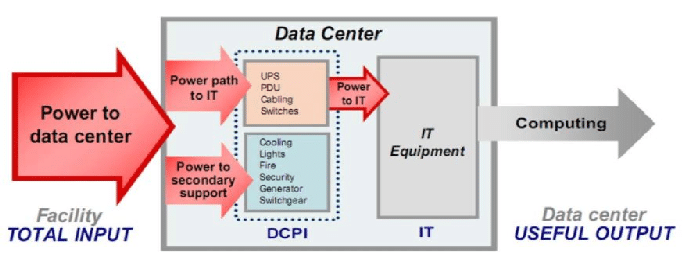
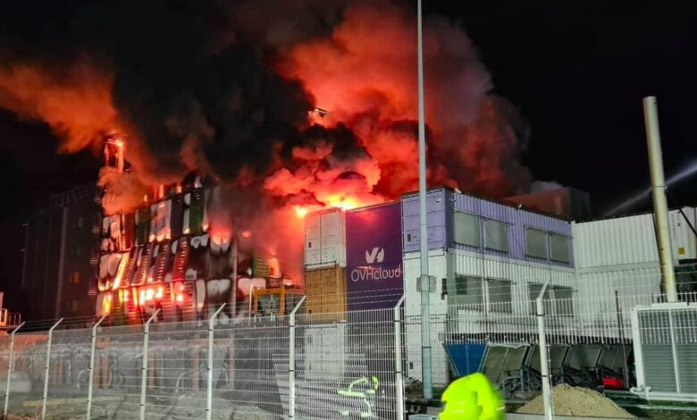

# Data Center

Analizziamo più in dettaglio i data center, che come abbiamo visto sono tra i principali utilizzatori di energia elettrica sia per Internet che in assoluto a livello globale.

Secondo il [DPT Group](https://dptgroup.com/), una grande azienda che fornisce servizi di raffreddamento, l'energia elettrica in un data center è divisa come segue:

In dettaglio l'energia in ingresso ad un data center è, in generale, divisa come segue:

Come si può vedere, circa la metà del consumo energetico è dovuta al raffreddamento. Nuovi e più efficienti metodi di raffreddamento possono avere un grande impatto, e questo è anche uno dei motivi per cui si cercano di fare data center in luoghi più freddi (nord Europa), vicino al mare o addirittura [sottomarini](https://news.microsoft.com/source/features/sustainability/project-natick-underwater-datacenter/).

Problemi all'impianto di raffreddamento possono portare ad importanti disastri, come quello avvenuto in Francia a marzo 2021 nei [data center di OVH](https://news.microsoft.com/source/features/sustainability/project-natick-underwater-datacenter/).

